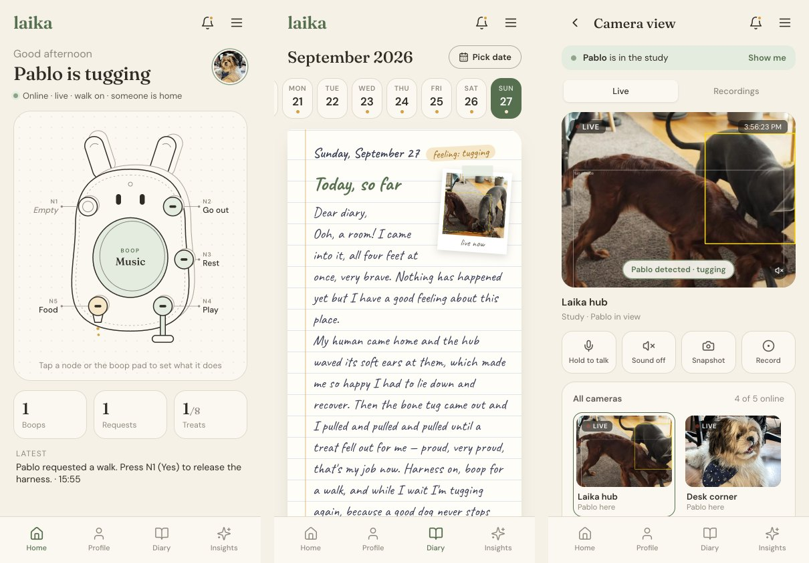

# Laika: A Pet Buddy

A wall-mounted hub that lets a dog **ask** for things (a walk, play, rest, a treat) by pulling a strap, booping a
pad or pressing a button. The hub answers with a treat, a rolled ball, a released harness or a wave of its ears.
A camera watches over the dog, and every evening the dog "writes" a diary about its day.


Laika is a physical device plus the software that runs it:

- **The hub** is a soft, wall-mounted body with a central boop pad, two expressive ears, a camera, microphone and
  speaker, and five modular nodes for straps, buttons and a treat/ball spout. See [Hardware](#hardware).
- **The hub brain** (`laika.hub`) turns every pull, boop and button press into safe, predictable outcomes.
  Harder pulls never win. Treats are capped and sensor-confirmed, and the harness is only released after the
  owner says yes.
- **The camera** (`laika.camera`) tracks the dog, spots people and labels behaviour (sleeping, tugging, zoomies,
  waiting at the door…). When someone comes home, the hub waves its ears hello.
- **The diary** (`laika.diary`) uses Claude to turn the day's camera footage and hub events into a short, warm diary
  entry in the dog's voice. It may only mention things that actually happened. The owner also gets a separate,
  factual report.
- **The web app** (`web/`) is mobile-first: dashboard, live camera, diary, notifications and safety controls.



## Hardware

The hub mounts on the wall. A rear chassis carries every pull into a structural wall plate, so the soft front shell
never takes the load.

| Part | What it does |
|---|---|
| **Boop pad** (centre) | Pressure-sensing pad with a light halo. One boop asks for a walk. |
| **Ears** | Slow, torque-limited gestures: *available*, *success*, *hello*. They stop if obstructed. |
| **Camera, mic, speaker** | See and hear the dog. The speaker plays quiet cues and calm music. |
| **N1** (upper left) | Owner's **Yes** button: confirms a walk or a choice, or cues tidying. |
| **N2** (upper right) | Dog-pressed button for calm audio. |
| **N3** (left) | Ball pocket: drop the ball in, and it comes back out of N5. |
| **N4** (lower right) | **Resistance node**: a motorised strap with a load sensor for tug, the harness, or choice tokens. |
| **N5** (lower left) | **Output spout**: drops one treat or rolls the ball, with a sensor that confirms it happened. |

Attachments are swappable cartridges that identify themselves (type, revision, safety class, calibration).

Safety is built into the hardware, not only the software:
- slip protection that works with the power off;
- retraction that stops on unexpected tension;
- no pinch points;
- washable food parts kept separate from the electronics;
- a watchdog that stops the motors if control fails.

The hardware talks to the software through JSON. Sensors post inputs such as
`{"type":"pull","node":"N4","force":5.1,"duration_ms":600}`, and carry out the `actions` the hub returns
(`dispense_treat`, `retract_strap`, `ear_wave`…).

Full details: [docs/hardware.md](docs/hardware.md).

## Installation

Requirements:
- Python 3.10+
- Node 18+ (only for the web app)
- An [Anthropic API key](https://console.anthropic.com/) for the diary (optional; without one you get plain
  fallback text)

```bash
git clone https://github.com/mauryapg13/Laika-A-Pet-Buddy.git
cd Laika-A-Pet-Buddy
python -m venv .venv && source .venv/bin/activate     # Windows: .venv\Scripts\activate
pip install -e "backend[dev]"
cd web && npm install && cd ..
```

Two optional steps:

```bash
# Dog/person detector (10.9 MB, AGPL-3.0). Without it, the camera falls back to motion tracking only.
mkdir -p models && curl -L -o models/yolo11n.onnx \
    https://github.com/ultralytics/assets/releases/download/v8.3.0/yolo11n.onnx

# Claude key for the diary. For an org-level key, also add ANTHROPIC_WORKSPACE_ID=...
echo "ANTHROPIC_API_KEY=sk-ant-..." > .env
```

## Usage

Run the back end and the web app in two terminals:

```bash
laika-server --camera          # hub + camera + diary on http://localhost:5050
cd web && npm run dev                  # web app on http://localhost:5173
```

Open http://localhost:5173. On a phone on the same Wi-Fi, use the Network URL that Vite prints. The dashboard
follows what the camera sees, the Diary tab fills in as the day goes on, and **Finish the day** writes the
whole-day entry.

With no dog around, add `--track-anything` so the camera treats whatever moves as the dog. With no camera, replay a
clip: `--source path/to/clip.mp4`.

No hardware yet? Act as the dog by sending the hub's JSON inputs. For example, six pulls on the tug strap earn a
treat:

```bash
curl -X POST localhost:5050/input -H "Content-Type: application/json" -d '[
  {"type":"owner","action":"offer","feature":"tug"},
  {"type":"pull","node":"N4","force":5,"duration_ms":700}, {"type":"pull","node":"N4","force":5,"duration_ms":700},
  {"type":"pull","node":"N4","force":5,"duration_ms":700}, {"type":"pull","node":"N4","force":5,"duration_ms":700},
  {"type":"pull","node":"N4","force":5,"duration_ms":700}, {"type":"pull","node":"N4","force":5,"duration_ms":700}]'
```

The last response includes `"treats_today": 1`, and the diary gains a line about the treat.

Other entry points:

| Command | What it does |
|---|---|
| `laika-server` | Hub API only (no camera) |
| `laika-live` | Stand-alone camera + diary page with "be the dog" buttons (http://localhost:8765) |
| `laika-diary <video>` | Whole-day diary + owner report from a recorded video |
| `python backend/demo/run_demo.py` | Plays the hub's six feature stories in the terminal |
| `pytest backend` | Runs the test suite |

### Project layout

```
backend/                 Python back end (pip install -e backend)
├── laika/
│   ├── hub/             hub brain: node state machine, 6 features, safety rules, small ML
│   ├── api/             HTTP API around the hub (+ camera and diary with --camera)
│   ├── camera/          OpenCV + YOLO dog/person tracking → behaviour episodes
│   └── diary/           hub + camera events → Claude diary, owner report, live mode
├── demo/                scripted hub stories and explainer video
├── tests/               pytest suite
└── pyproject.toml       dependencies and the laika-* commands
web/                     owner web app (React + Vite)
docs/                    reference docs, product requirements, images
data/videos/             camera zone files for the test clips
```

### Documentation

- [Hardware](docs/hardware.md): body, boop pad, ears, the five nodes, sensors and actuators, safety, and how it talks to the software.
- [Hub reference](docs/hub.md): nodes and buttons, the 6 features, safety rules, JSON inputs and outputs, HTTP API.
- [Camera, diary and back end](docs/camera-and-diary.md): camera behaviours, how the diary stays honest, live mode
  and batch runs.
- [Web app](web/README.md): screens, and which data is live and which is mock.
- [Product requirements](docs/PRD.md).
- [Demo video](backend/demo/demo_video.mp4) (36 s): every hub story with its input and output JSON.

## Support

Found a bug or have a question? [Open an issue](https://github.com/mauryapg13/Laika-A-Pet-Buddy/issues).

## Roadmap

- Connect the hardware prototype through a sensor bridge that posts the same JSON inputs; see
  [hardware.md §4](docs/hardware.md#4-how-the-hardware-talks-to-the-software).
- Align the web app's node setup screen with the hub's fixed nodes, then make it live.
- Wire Insights to `GET /summary`, and add bark detection for Voice tracking.
- Keep hub state across restarts. It is in memory today, so each restart starts a fresh day.
- Retrain the ML parts on real activity logs instead of simulated days.

## Contributing

1. Create a branch and make your change.
2. Run `pytest backend` and, for web changes, `cd web && npm run build`.
3. Open a pull request into `main`.

Safety limits live in [`backend/laika/hub/config.py`](backend/laika/hub/config.py). Change them there, never in ML code.

## Authors

- **Rohitkumartangudu**: hub device model, API and demo
- **Mithravinda KG**: web app design and frontend
- **Maurya PG**: camera, diary and integration
- **Ankit Kumar**: prototype development, design, pitch deck, hardware testing, integration and iteration

The product was built at a Claude Opus Build Day. Test clips are from [Pexels](https://www.pexels.com/), and the
detector is [Ultralytics YOLO11](https://github.com/ultralytics/ultralytics).

## License

[MIT](LICENSE). The optional YOLO11 detector model (`models/yolo11n.onnx`, not included in this repository) is
separately licensed under AGPL-3.0.

## Project status

Working prototype. The software runs end to end, and the hardware prototype is being built and tested. The two
aren't connected yet (the software uses simulated sensors), and several web app screens still use mock data.
