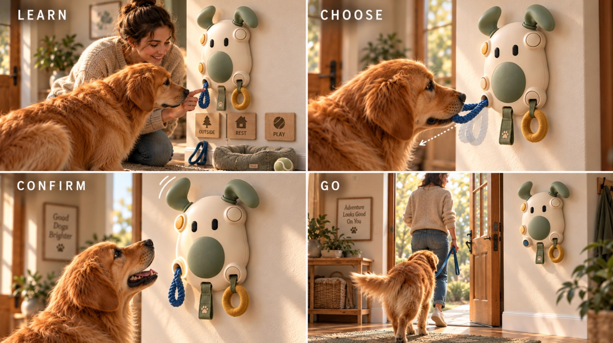
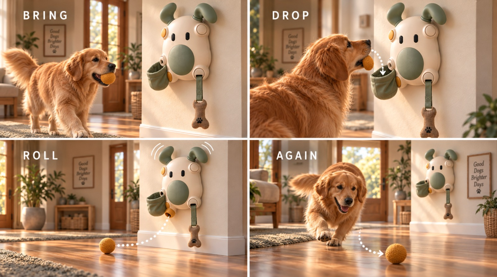
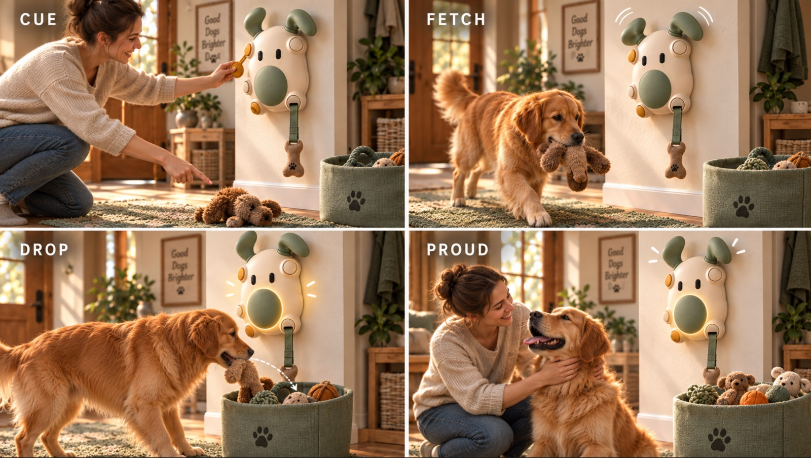
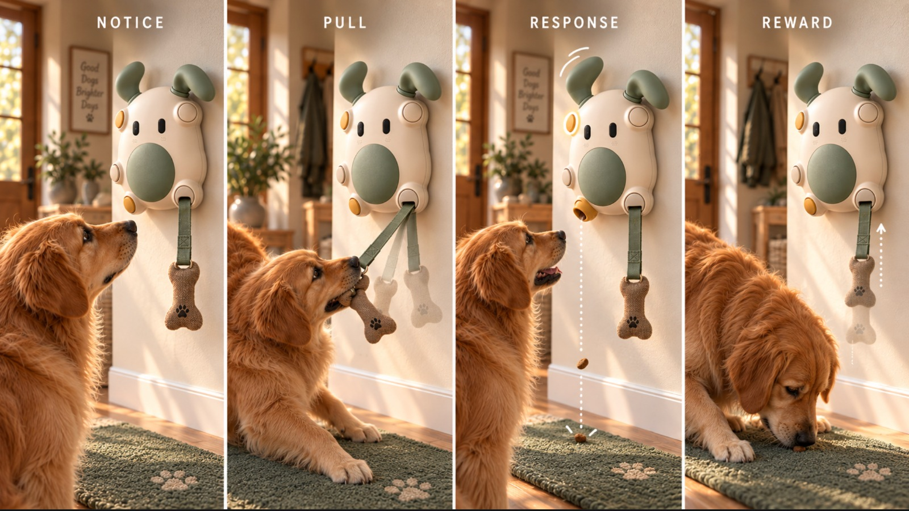
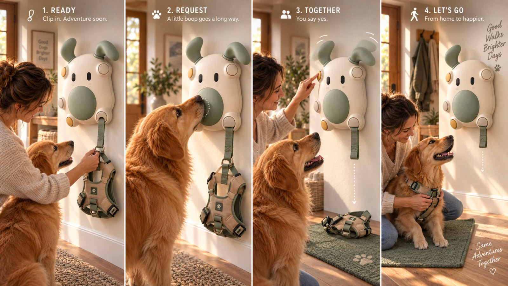
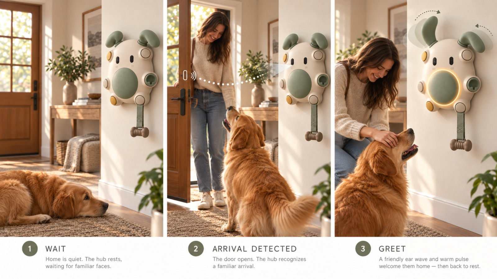

# Laika: A Pet Buddy · Device Model

This is the **brain of the Laika wall hub for dogs** (called *PawHub* in the product requirements).
It reads everything that happens at the hub (dog pulls, boops, owner button presses, camera detections, sensor
confirmations) as **JSON**, applies the product's safety and behaviour rules plus a little ML, and returns the
**full state of the hub as JSON**.

- The **web app** (teammate) sends inputs and draws the hub from the output JSON.
- The **camera AI** ([`camera/`](camera/)) sends detections such as `HUMAN_DETECTED`, and the **diary**
  ([`diary/`](diary/)) turns the day's camera footage and hub events into the dog's diary and an owner report.
  See [section 12](#12-camera--diary).
- The **hardware** (when connected) sends sensor inputs and carries out the `actions` in the output.

> ▶ **Quick look:** watch [`demo/demo_video.mp4`](demo/demo_video.mp4) (36 s). It shows every story with the input JSON, the output JSON and the hub reacting.
> 📄 Product requirements: [`docs/PRD.md`](docs/PRD.md) · story images: [`docs/images/`](docs/images/)

---

## Contents
1. [Quick start](#1-quick-start)
2. [The hub: every node and button](#2-the-hub-every-node-and-button)
3. [The 6 features (stories)](#3-the-6-features-stories)
4. [Safety rules](#4-safety-rules-always-on-no-ml-involved)
5. [ML / AI](#5-ml--ai)
6. [JSON contract: inputs](#6-json-contract-inputs)
7. [JSON contract: output](#7-json-contract-output)
8. [HTTP API (for the web app)](#8-http-api-for-the-web-app)
9. [Integration guides](#9-integration-guides)
10. [Project structure, tests, video](#10-project-structure-tests-video)
11. [Known limitations](#11-known-limitations)
12. [Camera + diary](#12-camera--diary)

---

## 1. Quick start

Requires Python 3.9+.
```bash
git clone https://github.com/mauryapg13/Laika-A-Pet-Buddy.git
cd Laika-A-Pet-Buddy
python -m venv .venv
# Windows: .venv\Scripts\activate      macOS/Linux: source .venv/bin/activate
pip install -r requirements.txt

# run everything from the project root
python -m demo.run_demo     # plays all 6 stories in the terminal, writes demo/demo_output.json
python -m api.server        # starts the JSON API on http://0.0.0.0:5000
python -m pytest -q         # runs the 23 tests
python -m demo.make_video   # (optional) re-creates demo/demo_video.mp4
```
Use it directly from Python:
```python
from device_model import Hub
hub = Hub()
hub.handle({"type": "owner", "action": "offer", "feature": "walk"})
out = hub.handle({"type": "boop"})
print(out["notifications"])   # ['10:07 Dog requested a walk. Press N1 (Yes) to release the harness.']
```

---

## 2. The hub: every node and button

Front view, matching the product images:
```
                 (LEFT EAR)                 (RIGHT EAR)
                      \                         /
        ┌───────────────────────────────────────────┐
        │  [N1 ● yellow]     o     o     [N2 ○ cream] │   o o = eyes (camera + microphone)
        │                                             │
        │  [N3 ○ white]      ╭─────────╮              │
        │  (+ ball pocket)   │  BOOP   │  ← halo light ring around the pad
        │                    │  PAD    │              │
        │                    ╰─────────╯              │
        │  [N5 ● yellow spout]            [N4 ○ strap]│
        └───────────────────────────────────────────┘
               ↓ treat / ball               │
                                        strap + attachment
                               (bone tug / harness / choice tokens)
```

### 2.1 Summary table

| ID | Part | Position | Used by | Function(s) | JSON input |
|---|---|---|---|---|---|
| `BOOP` | Big green boop pad + halo light | centre | dog (nose/paw) | **Walk request** | `{"type":"boop"}` |
| `N1` | Yellow button | upper-left | **owner** | **Yes / Confirm** (walk, My Choice) · **Tidy cue** | `{"type":"button","node":"N1"}` |
| `N2` | Cream round button | upper-right | dog | **Calm audio on/off** | `{"type":"button","node":"N2"}` |
| `N3` | White button + fabric pocket | left side | dog | **Ball return sleeve** (Roll Again) | `{"type":"ball_in"}` |
| `N4` | Strap socket (motor + load sensor) | lower-right | dog | **Resistance strap**: bone tug · harness holder · choice tokens | `{"type":"pull","node":"N4",...}`, `{"type":"release","node":"N4"}` |
| `N5` | Yellow spout | lower-left | output only | **Treat drop** · **ball roll-out** | confirmations: `output_confirmed` / `output_failed` |
| `C_LEFT` `C_CENTER` `C_RIGHT` | Choice tokens | lower sockets (My Choice layout) | dog | **OUTSIDE / REST / PLAY** | `{"type":"pull","node":"C_LEFT",...}` |
| ears | Two soft ears | top | output only | Show state and delight | output field `ears` |
| halo | Light ring around the boop pad | centre | output only | Show state and success | output field `halo` |
| eyes | Camera + mic | face | teammate's camera AI | Detect a person → greeting | `{"type":"camera","event":"HUMAN_DETECTED","confidence":0.9}` |
| basket | Tidy basket sensor | floor | dog | Toy deposited (Tidy Together) | `{"type":"toy_in_basket"}` |

### 2.2 Each node in detail

#### BOOP: central boop pad (dog)
- **What it does:** the dog asks for a walk by booping once.
- **Works when:** the owner has clipped the harness on N4 (`offer walk`). Otherwise the boop is only logged.
- **Rules:** one boop = one request. Further boops are ignored for 2 min (cooldown) and while a request is waiting.
- **States (`nodes.BOOP.state`):** `IDLE` (walk not offered) · `ENABLED` (a boop will create a request) · `COOLDOWN`.
- **Feedback:** one-ear lift + green halo (`success`), and the owner is notified.

#### N1: yellow button, upper-left (owner)
Its meaning depends on the situation, checked in this order:
1. **A walk request is waiting** → **Yes**: the harness is released onto the mat (`release_harness`).
2. **A My Choice selection is waiting** → **Confirm**: the choice is confirmed (e.g. OUTSIDE).
3. **Nothing active** → **Tidy cue**: starts a 2-minute Tidy Together round.
4. Anything else → ignored and logged.
- **States:** `IDLE` · `WAITING_CONFIRM` (the web app should highlight this button).

#### N2: cream button, upper-right (dog)
- **What it does:** the dog presses it to start **calm enrichment audio**, and presses again to stop.
- **Rules:** max volume 40 %, switches off automatically after 30 min.
- **States:** `ON` · `OFF`.

#### N3: side button + ball pocket, left (dog)
- **What it does:** Roll Again. The dog drops the ball in the pocket, the sensor detects it, and N5 rolls the ball back out.
- **Works when:** the owner has offered `roll`.
- **Rules:** max 10 rolls per session, at least 3 s between rolls, the session ends after 2 min without a ball.
- **States:** `ACTIVE` (Roll Again on) · `PARKED`.

#### N4: strap, lower-right (dog, resistance node)
The strap carries a different attachment for each feature:

| Feature offered | Attachment | What pulling does |
|---|---|---|
| `tug` | `bone_tug` | valid pulls count as reps; **6 reps → 1 treat** |
| `walk` | `harness` | holds the harness; released only after the owner's N1 |
| `choice` | `choice_tokens` | tokens are pulled through `C_LEFT / C_CENTER / C_RIGHT` |

**State machine (`nodes.N4.state`):**
```
 PARKED ──offer──▶ READY ──first valid pull──▶ ACTIVE ──6th rep / time limit──▶ COOLDOWN
   ▲                 │                                                        │
   │                 └────────── owner park / switch feature ─────────────────┤
   └──────────── strap retracts slowly (only after the dog lets go) ◀── release┘

 any state ──5 hard pulls in 20 s──▶ LOCKOUT (10 min) ──▶ PARKED
 any state ──owner "stop"─────────▶ FAULT ──owner "reset"──▶ PARKED
```
| State | Meaning | Pull effect |
|---|---|---|
| `PARKED` | strap retracted / not offered | **ignored** (logged only) |
| `READY` | offered, waiting for the dog | first valid pull starts the session |
| `ACTIVE` | tug in progress, resistance 1→3 rises gently | valid pulls count |
| `COOLDOWN` | round finished, resistance tapered to 0 | ignored; waiting for release |
| `RETRACTING` | session ended mid-play, waiting for release | ignored |
| `LOCKOUT` | frantic pulling detected | ignored for 10 min |
| `FAULT` | emergency stop | everything ignored until reset |

- **Valid pull:** force ≥ the learned threshold (starts at 3 N, learned between 2 and 8 N) **and** duration 200 ms–4 s.
- **Harder never wins:** a 11 N pull counts exactly like a 5 N pull, and pulling a parked strap does nothing.
- Also in the output: `attachment` and `resistance` (0–3).

#### N5: yellow spout, lower-left (output)
- **Treat drop:** after a tug round, if the limits allow it.
- **Ball roll-out:** in Roll Again.
- **Sensor-confirmed:** the output counts only after the hardware sends `output_confirmed`. If it sends `output_failed`
  (jam), it's logged as a failure, N5 goes to `FAULT`, the owner is notified, and **there is no automatic retry**.
- **States:** `IDLE` · `BUSY` (output in progress, a second output cannot start) · `FAULT`.

#### Choice tokens: `C_LEFT`, `C_CENTER`, `C_RIGHT` (dog)
| Slot | Token | Meaning |
|---|---|---|
| `C_LEFT` | blue rope | **OUTSIDE** |
| `C_CENTER` | paw strap | **REST** |
| `C_RIGHT` | yellow ring | **PLAY** |
- One valid pull selects that token. The slot lights up (`choice_slots.<slot>.light = true`), one ear lifts, and the owner is notified.
- Only **one choice per 60 s window**; other tokens are ignored. The owner confirms with N1.
- The meanings are set in `device_model/config.py` (`CHOICES`) and can be changed by the owner.

#### Ears and halo (outputs)
| `ears` value | Meaning / motor gesture |
|---|---|
| `neutral` | idle / rest |
| `small_open` | an activity is **available** (just offered) |
| `one_ear_lift` | request received / success |
| `wave` | greeting or celebration (arrival, walk confirmed, ball rolled, toy tidied) |
| `rhythm` | gentle movement during tug play |
| `slow_down` | session closing / lockout |

| `halo` value | Meaning / light |
|---|---|
| `off` | no light |
| `soft_on` | activity available |
| `success` | request received / confirmed (green) |
| `warm_pulse` | greeting / walk confirmed (warm orange pulse) |
| `glow` | "proud" celebration (Tidy) |
| `rhythm` | pulsing during tug play |

---

## 3. The 6 features (stories)

Each story matches one product image (in `docs/images/`). Full input/output for every step: `demo/demo_output.json`.

### 3.1 My Choice: Learn → Choose → Confirm → Go


| Step | Input | Output highlights |
|---|---|---|
| Owner clips the 3 tokens | `{"type":"owner","action":"offer","feature":"choice"}` | `mode: choice`, `N4: READY (choice_tokens)`, `extend_strap` |
| Dog pulls the blue rope | `{"type":"pull","node":"C_LEFT","force":4.2,"duration_ms":700}` | `REQUEST_CREATED (OUTSIDE)`, `light_slot C_LEFT`, `ears: one_ear_lift`, notify "Dog selected OUTSIDE" |
| Dog tugs another token | `{"type":"pull","node":"C_RIGHT",...}` | `INPUT_IGNORED (choice already made in this window)` |
| Owner presses N1 | `{"type":"button","node":"N1"}` | `HUMAN_CONFIRMED`, `ears: wave` |

### 3.2 Roll Again: Bring → Drop → Roll → Again


| Step | Input | Output highlights |
|---|---|---|
| Owner offers | `{"type":"owner","action":"offer","feature":"roll"}` | `mode: roll`, `N3: ACTIVE` |
| Ball in pocket | `{"type":"ball_in"}` | action `roll_ball` (N5), `N5: BUSY`, `ears: wave` |
| Spout confirms | `{"type":"output_confirmed","node":"N5"}` | `rolls_session +1`, `N5: IDLE` |
| 2 min without a ball | `{"type":"tick"}` | `SESSION_ENDED (idle timeout)` |

### 3.3 Tidy Together: Cue → Fetch → Drop → Proud


| Step | Input | Output highlights |
|---|---|---|
| Owner presses N1 (nothing pending) | `{"type":"button","node":"N1"}` | `TIDY_CUE`, `mode: tidy`, `play_sound tidy_cue` |
| Toy in basket | `{"type":"toy_in_basket"}` | `TIDY_DEPOSIT`, `halo: glow`, `ears: wave`, `toys_tidied_session +1` |
| 2 min without a toy | `{"type":"tick"}` | `SESSION_ENDED` |

### 3.4 Tug → Treat: Notice → Pull → Response → Reward (keeps the dog active)


| Step | Input | Output highlights |
|---|---|---|
| Tug offered | `{"type":"owner","action":"offer","feature":"tug"}` | `N4: READY (bone_tug)`, `ears: small_open` |
| Reps 1-5 | `{"type":"pull","node":"N4","force":4.8,"duration_ms":650}` | `PULL_VALID`, `N4: ACTIVE`, `tug_reps`, `resistance` 1→3 |
| Rep 6 | same | actions `dispense_treat` + `taper_resistance`, `N4: COOLDOWN`, `treats_today` **not yet counted** |
| Treat confirmed | `{"type":"output_confirmed","node":"N5"}` | `treats_today +1`, notify "Dog completed a tug round and got a treat (1/8 today)" |
| Dog lets go | `{"type":"release","node":"N4"}` | `retract_strap`, `N4: PARKED`, `mode: idle` |
| Dog pulls the parked strap hard | `{"type":"pull","node":"N4","force":11,...}` | `INPUT_IGNORED`, **no action** |

### 3.5 Walk request: Ready → Request → Together → Let's go


| Step | Input | Output highlights |
|---|---|---|
| Owner clips harness | `{"type":"owner","action":"offer","feature":"walk"}` | `N4: READY (harness)`, `BOOP: ENABLED` |
| Dog boops | `{"type":"boop"}` | `REQUEST_CREATED (walk)`, `N1: WAITING_CONFIRM`, notify |
| Dog boops again | `{"type":"boop"}` | `INPUT_IGNORED (cooldown)` |
| Owner presses N1 | `{"type":"button","node":"N1"}` | `HUMAN_CONFIRMED`, action `release_harness` (N4), `ears: wave`, `halo: warm_pulse` |
| Harness drop confirmed | `{"type":"output_confirmed","node":"N4"}` | `N4: PARKED`, notify "Harness released onto the mat" |

If the owner doesn't answer within 10 min, the request expires (`REQUEST_EXPIRED`).

### 3.6 Arrival greeting: Wait → Arrival detected → Greet


| Step | Input | Output highlights |
|---|---|---|
| Camera, low confidence | `{"type":"camera","event":"HUMAN_DETECTED","confidence":0.45}` | `INPUT_IGNORED (low confidence)` |
| Camera, confident | `{"type":"camera","event":"HUMAN_DETECTED","confidence":0.93}` | `GREETING`, actions `ear_wave` + `halo_pulse warm`, `ears: wave` |
| Next update | any | back to `neutral` / `off` (rest) |

Greets at most once per 10 min. The owner can turn greetings off (`greeting_off`).

### 3.7 Extras
- **N2 audio:** dog presses N2 → `audio_start`; presses again → `audio_stop`.
- **Owner controls:** `park` (end a session), `stop` (emergency stop → `FAULT`), `reset`, `treats_on/off`, `greeting_on/off`.

---

## 4. Safety rules (always on, no ML involved)

All values are in `device_model/config.py` → `LIMITS`.

| Rule | Value |
|---|---|
| Treats per day / per hour | **8 / 3** |
| Valid pulls needed per treat | **6** |
| Valid pull duration | 200 ms – 4 s |
| Pull threshold bounds (ML may only move it inside these) | 2 – 8 N (default 3 N) |
| Tug session max length | 3 min |
| Max tug resistance | level 3 (rises gently, never used as punishment) |
| Frustration guard | **5 pulls ≥ 12 N within 20 s → lockout 10 min** + factual notification |
| Walk boop cooldown / request expiry | 2 min / 10 min |
| My Choice window | 60 s (one choice) |
| Roll Again | 10 rolls/session, 3 s gap, 2 min idle timeout |
| Tidy window | 2 min |
| Greeting | confidence ≥ 0.7, max once per 10 min |
| Audio | auto-off after 30 min, volume ≤ 40 % |

**Behaviour principles from the product requirements:**
- "Unavailable" means **parked**, never "pull harder".
- Stronger pulls never give a better outcome.
- Repeated inputs never repeat an output.
- Outputs count only when the sensor confirms them.
- The harness is released only after the owner confirms.
- Notifications state facts, never emotions ("5 high-force pulls occurred within 20 seconds", not "your dog is angry").

---

## 5. ML / AI

ML only **personalises, detects and suggests**. It never controls force, treats or the harness release.

| Component | How it works | Output field |
|---|---|---|
| **Learned pull threshold** | 0.8 × the 30th percentile of the dog's own valid pulls (last 50, needs ≥ 5), **clamped to 2-8 N**. Very hard pulls (≥ 12 N) are excluded | `ml.pull_threshold_n` |
| **Unusual-activity detector** | Isolation Forest trained (in < 1 s at start-up) on simulated normal hours. Features per hour: boops, valid pulls, treats, rolls, tidy deposits, ignored inputs. Checked once per minute | `ml.anomaly` (e.g. `"Unusual hour: pulls 40 (normal ~4.0)"`), else `null` |
| **Activity suggestion** | if there's been no dog interaction for 2 h during the day (08-21 h) and nothing is active | `ml.suggestion` |
| **Daily summary** | built **only from recorded events**. Treats counted only when confirmed; camera events keep their confidence | `GET /summary` |

---

## 6. JSON contract: inputs

Send one object (or a list) to `hub.handle()` or `POST /input`.
`ts` (ISO time, e.g. `"2026-09-27T14:05:00"`) is optional; the default is the current time.

| Input | Sent by | Example |
|---|---|---|
| Offer a feature | app | `{"type":"owner","action":"offer","feature":"tug"}` (feature: `tug` `walk` `choice` `roll` `tidy`) |
| Owner command | app | `{"type":"owner","action":"park"}` (`park` `stop` `reset` `treats_on` `treats_off` `greeting_on` `greeting_off`) |
| Pull | hardware | `{"type":"pull","node":"N4","force":5.2,"duration_ms":700}` (node: `N4` `C_LEFT` `C_CENTER` `C_RIGHT`; force in newtons) |
| Release strap | hardware | `{"type":"release","node":"N4"}` |
| Boop | hardware | `{"type":"boop","duration_ms":300}` |
| Button | hardware | `{"type":"button","node":"N1"}` (`N1` owner, `N2` dog audio) |
| Ball in pocket | hardware | `{"type":"ball_in"}` |
| Toy in basket | hardware | `{"type":"toy_in_basket"}` |
| Output confirmed | hardware sensor | `{"type":"output_confirmed","node":"N5"}` (`N5` treat/ball, `N4` harness) |
| Output failed | hardware sensor | `{"type":"output_failed","reason":"jam"}` |
| Camera detection | camera AI | `{"type":"camera","event":"HUMAN_DETECTED","confidence":0.91}` (other events such as `DOG_DETECTED` or `BARK_EVENT` are logged) |
| Timer tick | app / loop | `{"type":"tick"}`: just advances timers (timeouts, expiry, suggestions) |

Unknown input types are answered with an `INPUT_REJECTED` event, and the hub does not crash.

---

## 7. JSON contract: output

Every call returns the **same shape**. Real example (tug, 6th pull):
```json
{
  "ts": "2026-09-27T10:06:50",
  "device_state": "ONLINE",
  "mode": "tug",
  "nodes": {
    "BOOP": {"role": "walk_request",  "state": "IDLE"},
    "N1":   {"role": "owner_confirm", "state": "IDLE"},
    "N2":   {"role": "audio",         "state": "OFF"},
    "N3":   {"role": "ball_pocket",   "state": "PARKED"},
    "N4":   {"role": "strap", "state": "COOLDOWN", "attachment": "bone_tug", "resistance": 0},
    "N5":   {"role": "output",        "state": "BUSY"}
  },
  "choice_slots": null,
  "ears": "one_ear_lift",
  "halo": "rhythm",
  "actions": [
    {"do": "dispense_treat",   "node": "N5"},
    {"do": "taper_resistance", "node": "N4"}
  ],
  "events": [
    {"event_id": 34, "ts": "2026-09-27T10:06:50", "event": "PULL_VALID", "mode": "tug", "node": "N4", "force_peak": 6.3, "rep": 6},
    {"event_id": 35, "ts": "2026-09-27T10:06:50", "event": "OUTPUT_REQUESTED", "mode": "tug", "output": "treat", "node": "N5"},
    {"event_id": 36, "ts": "2026-09-27T10:06:50", "event": "SESSION_COOLDOWN", "mode": "tug", "detail": "treat earned"}
  ],
  "notifications": [],
  "counters": {"treats_today": 0, "treats_last_hour": 0, "treats_limit_day": 8,
               "tug_reps": 6, "rolls_session": 0, "toys_tidied_session": 0},
  "ml": {"pull_threshold_n": 4.03, "anomaly": null, "suggestion": null}
}
```

### 7.1 Field reference
| Field | Type | Meaning | Who uses it |
|---|---|---|---|
| `ts` | string | time of this update | app |
| `device_state` | `ONLINE` / `FAULT` | FAULT = emergency stop pressed, needs `reset` | app (red banner) |
| `mode` | `idle` `tug` `walk` `choice` `roll` `tidy` | active feature | app |
| `nodes.<ID>.state` | see section 2 | live state of each button/node | app (draw the hub) |
| `nodes.N4.attachment` / `.resistance` | string / 0-3 | what's on the strap, current resistance | app, hardware |
| `choice_slots` | object / null | only in My Choice: token, meaning, `light` | app |
| `ears`, `halo` | string | gesture for this moment (section 2.2) | hardware + app animation |
| `actions` | list | **commands for the hardware** (7.2) | hardware |
| `events` | list | what just happened, including why inputs were ignored (7.3) | app timeline, summary |
| `notifications` | list of strings | factual owner messages | app (alerts / push) |
| `counters` | object | treats today / last hour, tug reps, rolls, toys | app dashboard |
| `ml` | object | learned threshold, anomaly text, suggestion | app |

### 7.2 Actions (hardware commands)
| `do` | Node | Meaning |
|---|---|---|
| `extend_strap` | N4 | bring the strap out with the given `attachment` |
| `retract_strap` | N4 | slowly retract (only sent after release) |
| `retract_strap_after_release` | N4 | retract as soon as the dog lets go (lockout) |
| `taper_resistance` | N4 | ramp resistance down to 0 |
| `release_harness` | N4 | drop the harness onto the mat |
| `dispense_treat` | N5 | drop exactly one treat |
| `roll_ball` | N5 | roll the ball out |
| `light_slot` | C_* | light the chosen token |
| `ear_wave` | ears | one slow ear wave |
| `halo_pulse` | halo | one warm light pulse |
| `play_sound` | speaker | `tidy_cue` or `success` |
| `audio_start` / `audio_stop` | speaker | calm enrichment audio |
| `stop_motors` | all | emergency stop |

### 7.3 Events
`FEATURE_OFFERED`, `SESSION_STARTED`, `SESSION_COOLDOWN`, `SESSION_ENDED`, `SESSION_LOCKED_OUT`, `LOCKOUT_ENDED`,
`PULL_START`, `PULL_VALID`, `PULL_RELEASE`, `BOOP`, `REQUEST_CREATED`, `REQUEST_EXPIRED`, `HUMAN_CONFIRMED`,
`OUTPUT_REQUESTED`, `OUTPUT_CONFIRMED`, `OUTPUT_FAILED`, `OUTPUT_BLOCKED` (limit reached / treats disabled),
`BALL_RETURNED`, `TIDY_CUE`, `TIDY_DEPOSIT`, `CAMERA_EVENT`, `GREETING`, `AUDIO_ON`, `AUDIO_OFF`,
`EMERGENCY_STOP`, `FAULT_RESET`, `SETTING`, `INPUT_IGNORED` (with the reason in `detail`), `INPUT_REJECTED`.

Every event has `event_id`, `ts`, `event` and `mode`, plus extra fields where relevant: `node`, `detail`, `force_peak`,
`pull_duration`, `rep`, `output`, `request`, `choice`, `camera_event`, `confidence`, `fault_code`.

---

## 8. HTTP API (for the web app)

Start: `python -m api.server` → `http://<laptop-ip>:5000`. CORS is open, so the web app can run on any host/port.

| Method | Path | Body / query | Returns |
|---|---|---|---|
| `POST` | `/input` | one input object **or a list** | output JSON (a list if a list was sent) |
| `GET` | `/state` | – | current output JSON (also advances timers) |
| `GET` | `/summary` | `?day=YYYY-MM-DD` (optional) | daily summary: counts, timeline, camera events |
| `GET` | `/events` | `?limit=100` | full event log |
| `GET` | `/layout` | – | the node map, choice tokens and limits (for labels) |

Examples:
```bash
curl -X POST localhost:5000/input -H "Content-Type: application/json" \
     -d '{"type":"owner","action":"offer","feature":"walk"}'
curl -X POST localhost:5000/input -H "Content-Type: application/json" -d '{"type":"boop"}'
curl localhost:5000/state
curl localhost:5000/summary
```
```javascript
// web app
const out = await fetch("http://<laptop-ip>:5000/input", {
  method: "POST", headers: {"Content-Type": "application/json"},
  body: JSON.stringify({type: "button", node: "N1"})
}).then(r => r.json());
```

---

## 9. Integration guides

### 9.1 Web app teammate
1. Poll `GET /state` every ~1 s (this also drives the timers) and draw the hub from `nodes`, `ears`, `halo`, `choice_slots`.
2. Show `notifications` as alerts, and `events` as a timeline (hide `PULL_START` if it's too noisy).
3. Owner controls → `POST /input` with `{"type":"owner",...}` or `{"type":"button","node":"N1"}`.
4. For a demo without hardware, add "be the dog" buttons that post `pull`, `boop`, `ball_in`, `toy_in_basket`,
   `release` and `output_confirmed`.
5. Daily page → `GET /summary`. Ready-made sample outputs for every step are in `demo/demo_output.json`.

### 9.2 Camera teammate
Post detections to `/input`:
```json
{"type": "camera", "event": "HUMAN_DETECTED", "confidence": 0.91}
```
`HUMAN_DETECTED` with confidence ≥ 0.7 triggers the greeting. Other events (`DOG_DETECTED`, `BARK_EVENT`, activity labels)
are stored with their confidence and appear in `/summary.camera`.

### 9.3 Hardware (not connected yet)
The sensors only need to produce the input JSON in section 6. For example, a microcontroller reads the N4 load cell
and sends `{"type":"pull","node":"N4","force":5.1,"duration_ms":600}` over USB serial, and a small bridge script posts
it to `/input`. The hardware then carries out each item in `actions` (motor, spout, ear servos, LEDs, speaker), and
sends `output_confirmed` / `output_failed` after every treat, ball or harness output.

---

## 10. Project structure, tests, video
```
Laika-A-Pet-Buddy/
├── device_model/            THE MODEL: the hub's brain (JSON in → JSON out)
│   ├── config.py            all safety limits, the node/button map, choice tokens   ← change behaviour here
│   ├── hub.py               Hub class: N4 strap state machine + the 6 features + owner controls
│   └── ml.py                learned pull threshold, unusual-activity detector, daily summary
├── api/
│   └── server.py            HTTP API (Flask) the web app and camera AI call: /input /state /summary /events /layout
├── demo/
│   ├── run_demo.py          plays the 6 image stories through the model, prints what happens
│   ├── demo_output.json     sample input + output JSON for every demo step (for the web app)
│   ├── make_video.py        renders demo_video.mp4 from the real model outputs
│   └── demo_video.mp4       36 s explainer video
├── docs/
│   ├── PRD.md               product requirements document
│   └── images/              the 6 story images (01_my_choice … 06_arrival_greeting)
├── camera/                  OpenCV + YOLO: tracks the dog, spots people, labels behaviour (section 12)
│   ├── vision.py            video → behaviour episodes, keyframes, human visits
│   ├── detector.py          YOLO11n dog/person detector (OpenCV DNN, no torch)
│   ├── config.py            zones + motion thresholds
│   ├── calibrate.py         draws zones/grid on a frame to set up a camera
│   └── synth_video.py       renders a cartoon test day with known ground truth
├── diary/                   camera + hub events → the dog's diary (Claude) and the owner report
│   ├── __main__.py          batch: `python -m diary <video>`
│   ├── live.py              live demo: `python -m diary.live` (webcam + in-process Hub + live diary)
│   ├── hub_events.py        Hub events → diary moments; simulated hub day; auto sensor confirm
│   ├── claude.py            keyframe captions + strict, grounded diary writing (Claude API)
│   └── owner_report.py      factual owner report (no LLM)
├── data/videos/             test clips (*.mp4 not committed) + per-clip *.zones.json
├── tests/
│   ├── test_hub.py          23 tests: every feature, every safety rule, ML, HTTP API
│   └── test_diary.py        camera/diary ↔ hub integration tests
├── conftest.py              lets pytest import the packages from the project root
└── requirements.txt
```
| If you want to… | Look at |
|---|---|
| change a limit (treats/day, cooldowns, thresholds) | `device_model/config.py` |
| understand or change what a button does | `device_model/hub.py` (one method per input: `_boop`, `_button`, `_pull`, …) |
| change the ML | `device_model/ml.py` |
| connect the web app / camera | `api/server.py` + section 8 |
| see real JSON examples | `demo/demo_output.json` |

## 11. Known limitations
- **Hardware isn't connected yet.** Everything runs in software; real sensors must send the same input JSON.
- ML is trained on **simulated** normal activity; it should be retrained on real logs once the hub is in use.
- State is kept in memory; restarting the server starts a fresh day.
- Single dog, single hub. Attachment detection is not automatic (the owner's `offer` sets the attachment).
- Post-MVP extras from the product requirements (Together Mode, Scent Quest) are not included.

---

## 12. Camera + diary

The camera watches the dog, the hub records what the dog does with it, and at the end of the day the dog "writes"
a diary entry about it. The owner gets a separate factual report.

```
camera ──► camera/vision.py (2-3 snapshots/s)                 Laika Hub (device_model)
            YOLO dog + person detection, MOG2 motion              ▲  camera inputs: HUMAN_DETECTED → greeting,
            → behaviour episodes, keyframes, human visits ────────┘                  DOG_<BEHAVIOUR> labels
                      │                                            │ events (tug reps, treats, walk requests,
                      ▼                                            ▼  greetings, lockouts, ball rolls, tidy…)
             diary/claude.py: one timeline → numbered "moments" → Claude writes the diary (only those moments)
             diary/owner_report.py: camera + hub counters → factual report (no LLM)
```

### 12.1 Setup
```bash
pip install -r requirements.txt
# Dog/person detector (10.9 MB, AGPL-3.0). Without it, tracking falls back to motion only.
mkdir -p models && curl -L -o models/yolo11n.onnx \
    https://github.com/ultralytics/assets/releases/download/v8.3.0/yolo11n.onnx
# Claude: create .env with ANTHROPIC_API_KEY=... (plus ANTHROPIC_WORKSPACE_ID=... for org-level keys).
# Optional: LAIKA_MODEL=claude-opus-5-5 (default claude-opus-5). Without a key you get plain fallback text.
```

### 12.2 Live demo (laptop camera)
```bash
python -m diary.live --name Biscuit          # open http://localhost:8765
```
- A real `Hub` runs in-process. The page's **Owner** buttons (offer tug / walk / ball / choice, N1, park) and
  **Dog** buttons (pull strap, let go, boop, ball in pocket, toy in basket, choice ropes, music) send the same JSON
  as `POST /input`. A simulated sensor confirms each output, the way the hardware will.
- The camera sends `HUMAN_DETECTED` with the detector's confidence, so Laika's arrival greeting fires for real. Each
  behaviour change is logged as a camera event (`DOG_TUGGING`, `DOG_SLEEPING`…).
- Behaviour changes and hub events become diary moments. About every 12 seconds, Claude adds a short, feelings-first
  line. **End of day** writes the whole-day entry, the real product deliverable, and saves the hub event log and
  summary to `out/live_…/`.
- Only a detected dog counts as the dog. People are masked out, so a person walking past is never tracked as the
  dog. For a demo without a dog, add `--track-anything`. To rehearse without a camera, replay a clip:
  `--source data/videos/<clip>.mp4`.

### 12.3 Whole-day batch run
```bash
python -m camera.synth_video data/videos/synthetic_day.mp4           # cartoon test day with known ground truth
python -m diary data/videos/synthetic_day.mp4 --name Biscuit --time-scale 280 --persona foodie
```
- Hub events come from `--hub-events events.json` (a list, e.g. saved from `GET /events`), from `--hub-url
  http://localhost:5000` (a running `python -m api.server`), or, by default, from a real `Hub` driven through a
  simulated day. That day lines up with the camera: tugging on camera becomes a tug round, waiting at the door
  becomes a walk request, and people seen become `HUMAN_DETECTED`. `--persona foodie|athlete|diva` sets the habits.
- Output goes to `out/<date>_<name>/`:
  - `diary.html` / `diary.md`: the dog's diary.
  - `report.html` / `report.md`: the owner report.
  - `diary_moments.json`: the allowed moments, plus which ones Claude used.
  - `hub_events.json`, `timeline.json`, `vision.json`, and `keyframes/`.
- `--time-scale` stretches a short clip over a day. Use `--time-scale 1` for real footage and set `--start` to when
  the recording began.

### 12.4 How the diary stays honest
- Code turns the merged timeline into a numbered list of plain moments, for example "pulled the bone tug" (×6,
  morning), "the hub gave me a treat for a good tug round", "my human came home and the hub waved its ears hello", or
  "no human came to see me". Claude only sees that list. It may skip or merge moments and add feelings, but it may
  not add events. It returns the IDs of the moments it used.
- "No human came" is only said for the stretch the camera actually watched, and only when the detector can see
  people in that footage.
- Keyframe captions (Claude vision, up to 12 per day in one call) check the tracker's labels. In the owner report
  they appear as "Photo check".

### 12.5 Camera details
- Behaviours: `sleeping` · `resting` · `wandering` · `zoomies` · `playing` · `tugging` · `eating` ·
  `waiting_at_door` · `away`. Zone-based ones (bowl, door, tug) need zones. Run
  `python -m camera.calibrate <video> 5` and put the result in `<video>.zones.json`.
- Speeds are measured in dog body lengths per second, so thresholds work for close-ups and wide shots alike. Net
  travel over about 2 s separates walking from tugging in place.
- A still dog fades into the MOG2 background, so an "empty room" reference tells a sleeping dog apart from one that
  left. A dog that is already lying down when the video starts is backfilled once it moves.
- Tested on:
  - The synthetic day: all 9 scripted segments recovered.
  - Three Pexels clips: dog at the bowl → `eating`, corgi at the door → `waiting_at_door`, two dogs with a rope toy →
    `tugging`.

