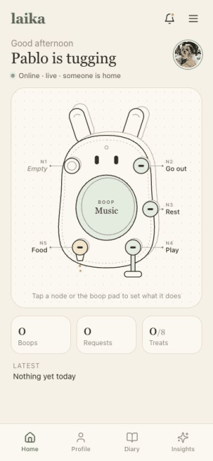
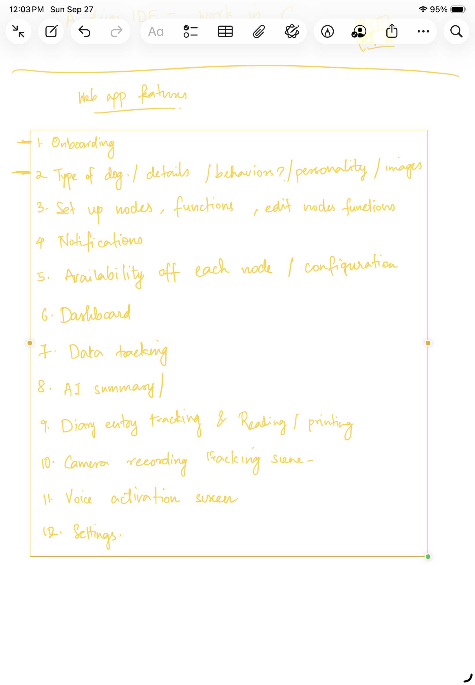
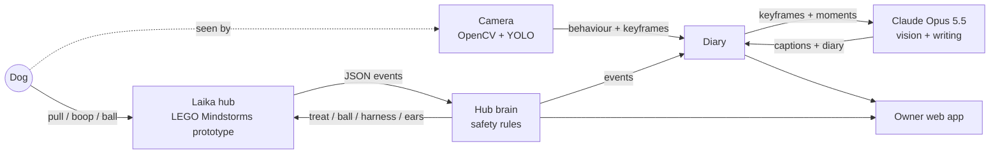

<div align="center">
  
  <sub>Concept render. The working prototype is built with LEGO Mindstorms (photo below).</sub>
  <h1>Laika: A Pet Buddy</h1>
  <p><b>Your dog can ask for a walk, a game or a treat, and tells you about its day.</b></p>
  <a href="MISSING.md"></a>
  <a href="MISSING.md"></a>
  
  
  <p><a href="#why">Why</a> · <a href="#see-it-work">Demo</a> · <a href="#photos">Photos</a> · <a href="#new-capability">New capability</a> · <a href="#how-it-works">How it works</a> · <a href="#run-it">Run it</a> · <a href="#team">Team</a></p>
</div>

## Why

Dogs spend long days alone while their people are at work. They can't say "I'm bored" or "I need to go out", and
owners come home not knowing how the day went. Laika is a soft friend on the wall that gives a dog a few simple
ways to ask, and answers kindly every time. Each evening the owner reads a short diary, written in the dog's own
voice, about what really happened.

## See it work

**The problem:** a dog alone at home can't ask for anything, and its owner can't see how its day went.

<div align="center">
  
  <br><sub>Real screen recording. The camera replays a test clip of dogs tugging; the hub counts a tug round and the diary writes itself.</sub>
</div>

**What just happened:**
1. **Input:** the camera sees tugging, and six strap pulls reach the hub. Here they are sent as sensor JSON,
   since the prototype isn't wired up yet.
2. **What Claude did:** it looked at camera frames to check what the dog was really doing. Then it wrote diary
   lines in the dog's voice, using only moments that were logged.
3. **Result:** the owner's app shows "Pablo is tugging", 1 treat out of 8, and a live diary entry.

## Photos

> [!IMPORTANT]
> Photos needed: the finished LEGO Mindstorms build, you with the build, team photo, wiring/mechanism close-ups,
> behind-the-scenes. Add them to `./docs/images` and attach them to the GitHub Release. See [MISSING.md](MISSING.md).

<table>
  <tr>
    <td align="center" width="33%"><b>Photo needed:</b><br>finished LEGO Mindstorms build</td>
    <td align="center" width="33%"><b>Photo needed:</b><br>you with your build</td>
    <td align="center" width="33%"><b>Photo needed:</b><br>team photo</td>
  </tr>
  <tr>
    <td align="center"><br><sub>UI: home, live diary, camera</sub></td>
    <td align="center"><br><sub>Sketch: our handwritten feature list</sub></td>
    <td align="center"><b>Photo needed:</b><br>wiring / mechanism close-up</td>
  </tr>
</table>

## New capability

**Claude Opus 5.5 checks the camera's guesses by looking at real, messy home-camera frames.** It then writes a warm
diary that stays strictly to the facts, and reports which facts it used.

A cheap motion tracker labels what the dog does. Claude Opus 5.5 reads a batch of keyframes in one call and corrects
the labels. This is a real run on our test clips:

| Tracker's guess | What Claude Opus 5.5 saw |
|---|---|
| tugging | "A grey Great Dane is mouthing a colorful rope toy on the rug… **no clear tug-of-war.**" |
| eating | "Standing next to the food bowl… **likely just finished eating** rather than eating now." |
| waiting at the door | "A corgi is lying on the doormat by the glass door looking outside." |

| Previous model | Claude Opus 5.5 |
|---|---|
| TODO: run the same frames and moments on the previous model | Corrects the tracker (above); writes the diary using only listed moments, returning their IDs |

**In the code:**
- Vision on keyframes: [`caption_keyframes`](backend/laika/diary/claude.py#L114-L138).
- Grounded diary: facts become numbered moments in [`diary_moments`](backend/laika/diary/claude.py#L155), and
  [`write_diary`](backend/laika/diary/claude.py#L232-L244) returns `used_moment_ids`.
- Live lines while the day happens: [`live.py`](backend/laika/diary/live.py#L195).

## How it works

A wall hub turns the dog's pulls and boops into safe, predictable responses. A camera labels what the dog is doing.
Claude checks the camera's frames and writes the diary. The owner's app shows it all live.



| Layer | Tool | Why |
|---|---|---|
| Hardware | LEGO Mindstorms prototype ([design](docs/hardware.md)) | Fast to build and change: straps, buttons, spout |
| Hub brain | Python ([`laika.hub`](backend/laika/hub/)) | Fixed safety rules: harder pulls never win, treats capped |
| Camera | OpenCV + YOLO11n ([`laika.camera`](backend/laika/camera/)) | Runs on a laptop CPU, finds dogs and people |
| AI | Claude Opus 5.5 ([`laika.diary`](backend/laika/diary/)) | Vision on keyframes, grounded diary writing |
| API | Flask ([`laika.api`](backend/laika/api/)) | One back end for hub, camera and diary |
| App | React + Vite ([`web/`](web/)) | Mobile-first owner app |

## Run it

**Works live:**
- Hub rules and safety limits, through the JSON API.
- Camera tracking (dog, people, behaviour) on a webcam or a replayed clip.
- Claude vision captions and the diary, live and end-of-day.
- Web app: dashboard, notifications, diary, camera tile, emergency stop.

**Mocked:**
- The software is not yet wired to the LEGO prototype. A simulated sensor confirms treats and balls.
- In the app: node setup, Insights, Voice tracking, Profile.

```bash
git clone https://github.com/mauryapg13/Laika-A-Pet-Buddy.git && cd Laika-A-Pet-Buddy
python -m venv .venv && source .venv/bin/activate && pip install -e "backend[dev]"
mkdir -p models && curl -L -o models/yolo11n.onnx https://github.com/ultralytics/assets/releases/download/v8.3.0/yolo11n.onnx
echo "ANTHROPIC_API_KEY=your-key" > .env
laika-server --camera                     # terminal 1: http://localhost:5050
cd web && npm install && npm run dev      # terminal 2: open http://localhost:5173
```

| Variable | Needed | What it does |
|---|---|---|
| `ANTHROPIC_API_KEY` | yes, for the diary | Claude API key |
| `ANTHROPIC_WORKSPACE_ID` | only for org-level keys | Workspace to bill |
| `LAIKA_MODEL` | no | Claude model (default `claude-opus-5-5`) |
| `LAIKA_DETECTOR_MODEL` | no | Path to a different detector model |

Hosted link live until: **TODO** (keep it up until at least 2026-10-27).

<details>
<summary>More commands and docs</summary>

| Command | What it does |
|---|---|
| `laika-server` | Hub API only |
| `laika-live` | Camera + diary page with "be the dog" buttons |
| `laika-diary <video>` | Whole-day diary and owner report from a video |
| `python backend/demo/run_demo.py` | The hub's six feature stories |
| `pytest backend` | 32 tests |

- [Hardware](docs/hardware.md), [hub reference](docs/hub.md), [camera and diary](docs/camera-and-diary.md),
  [web app](web/README.md), [product requirements](docs/PRD.md).
- License: [MIT](LICENSE). The optional YOLO11 model is AGPL-3.0 and not included.
</details>

## Team

<table>
  <tr>
    <td align="center"><br><b>Rohitkumartangudu</b><br><sub>Hub device model, API, demo</sub></td>
    <td align="center"><br><b>Mithravinda KG</b><br><sub>Web app design and frontend</sub></td>
    <td align="center"><br><b>Maurya PG</b><br><sub>Camera, diary, integration</sub></td>
    <td align="center"><b>Ankit Kumar</b><br><sub>Prototype, design, pitch deck, hardware testing, integration</sub></td>
  </tr>
</table>

The software was built with Claude Opus 5.5 at a Claude Opus Build Day.

## Rubric map

| Criterion | Evidence | Where |
|---|---|---|
| New capability | Opus 5.5 corrects the tracker from real frames and writes a diary grounded in logged moments | [New capability](#new-capability) |
| It works | Real screen recording, 32 tests, honest live/mocked list; LEGO prototype photos pending | [See it work](#see-it-work), [Run it](#run-it) |
| Keep or share | A daily diary of your dog's day, and a way for your dog to ask | [Why](#why) |
| Clarity of demo | Problem in one line, demo GIF on the first screen, input → Claude → result | [See it work](#see-it-work) |
